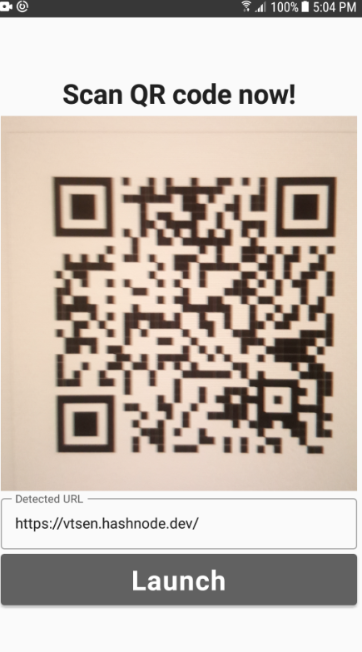

# QR Code Scanner - Jetpack Compose

This is a very simple QR code scanner / reader that decodes the URL link and allows you to launch an external web browser.

## Requirements
Android Studio Koala or later

## Tech Stack
- Jetpack Compose
- CameraX Jetpack library
- Google ZXing -  barcode encoding/decoding library

